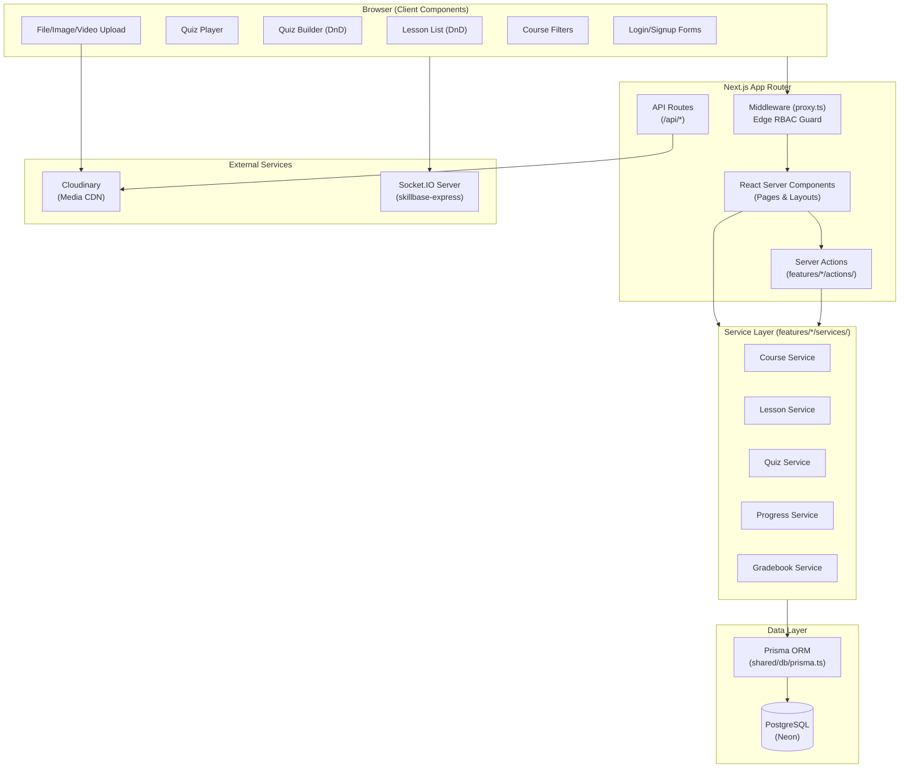
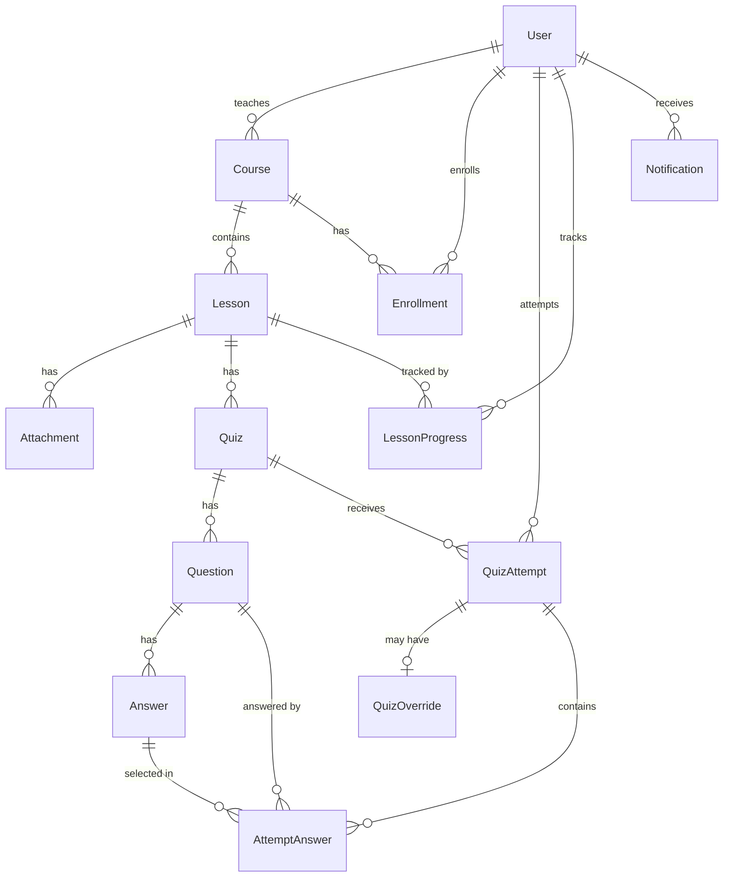
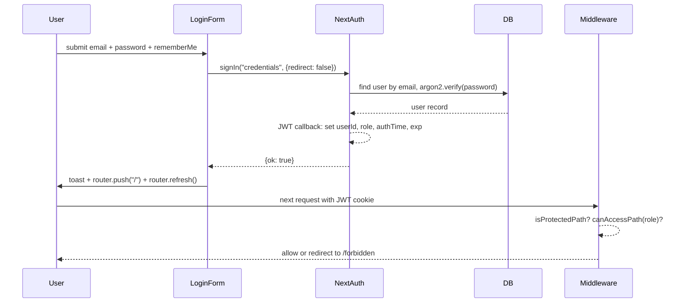
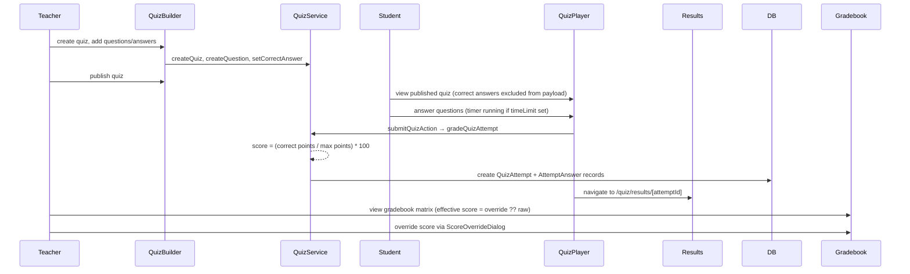
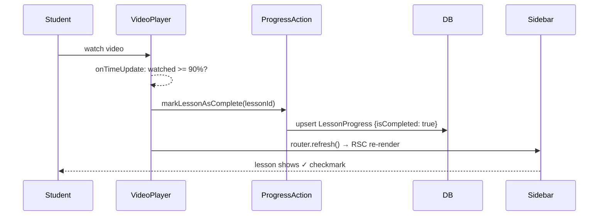

# Codebase Map

> Auto-generated by Cartographer. Last mapped: 2026-06-07T11:39:19Z

## System Overview



---

## Directory Structure

```
skillbase-next/
├── app/                          # Next.js App Router pages
│   ├── (protected)/              # Route group: auth-gated dashboard pages
│   │   ├── layout.tsx            # Protected layout: AppNavigation + session check
│   │   ├── dashboard/            # Role-based redirect hub
│   │   │   ├── admin/            # Admin-only pages (users, settings)
│   │   │   ├── student/          # Student dashboard + enrolled courses
│   │   │   └── teacher/          # Teacher dashboard + course/lesson/quiz management
│   │   └── socket-test/          # Dev-only Socket.IO connection test
│   ├── api/                      # API route handlers
│   │   ├── auth/[...nextauth]/   # NextAuth catch-all
│   │   ├── courses/[courseId]/gradebook/export/  # CSV export
│   │   ├── sign-image/           # Cloudinary image signing
│   │   ├── sign-video/           # Cloudinary video signing
│   │   └── sign-raw/             # Cloudinary file signing
│   ├── auth/                     # Public auth pages (login, signup)
│   ├── courses/                  # Public course catalog + student lesson viewer
│   │   └── [courseId]/lessons/[lessonId]/quiz/  # Student quiz player + results
│   ├── forbidden/                # 403 error page
│   ├── globals.css               # Tailwind v4 global styles + OKLCH design tokens
│   ├── layout.tsx                # Root HTML shell + fonts + Toaster
│   └── page.tsx                  # Root → redirects to /dashboard
│
├── features/                     # Feature-sliced domain modules
│   ├── auth/                     # Authentication + RBAC domain
│   │   ├── actions/              # client-actions.ts, server-actions.ts
│   │   ├── components/           # login-form, signup-form, profile-dropdown
│   │   ├── schemas/              # login.ts, signup.ts (Zod)
│   │   └── utils/                # config, rbac, roles, route-guards, routes, with-role
│   └── courses/                  # Course/Lesson/Quiz/Gradebook domain
│       ├── actions/              # server-actions, lesson-actions, quiz-actions,
│       │                         # progress-actions, gradebook-actions
│       ├── components/           # 23 components covering full course lifecycle
│       ├── schemas/              # schema.ts, lesson.ts, quiz.ts (Zod)
│       ├── services/             # service, lesson-service, quiz-service,
│       │                         # progress-service, gradebook-service
│       └── utils/                # auth.ts (validateCourseOwnership)
│
├── shared/                       # Cross-feature shared code
│   ├── components/               # app-navigation, editor (Tiptap), file/image/video-upload
│   ├── db/                       # prisma.ts singleton
│   ├── lib/                      # config, hooks, navigation, sanitize, socket, utils
│   └── ui/                       # shadcn/ui primitives (badge, button, card, dialog, etc.)
│
├── prisma/
│   ├── schema.prisma             # DB schema: 10 models, 2 enums
│   ├── seed.ts                   # Dev seed: 4 users, 2 courses, 3 lessons, 2 quizzes
│   └── migrations/               # SQL migration history
│
├── auth.ts                       # NextAuth v5 configuration (root)
├── proxy.ts                      # Next.js middleware (edge RBAC guard) ← named non-standard
├── next-auth.d.ts                # NextAuth type augmentation
├── next.config.ts                # Next.js config (React Compiler, Cloudinary image domains)
├── prisma.config.ts              # Prisma v7 defineConfig
└── components.json               # shadcn/ui CLI config
```

---

## Module Guide

### Auth Module (`features/auth/`)

**Purpose:** Authentication, session management, and role-based access control.
**Entry point:** `auth.ts` (root) — NextAuth v5 configuration.

| File | Purpose |
|------|---------|
| `auth.ts` | NextAuth credentials provider, JWT strategy, `rememberMe` TTL logic |
| `proxy.ts` | Edge middleware: protected path check → role check → public-auth redirect |
| `next-auth.d.ts` | Augments Session/JWT/User types with `userId`, `role`, `rememberMe` |
| `features/auth/utils/roles.ts` | Role constants, `SIGNUP_ROLES`, `ALL_ROLES` |
| `features/auth/utils/rbac.ts` | Path-to-role map, `normalizeRole`, `isRoleAllowed`, `ROLE_LABELS` |
| `features/auth/utils/routes.ts` | All `ROUTES` constants + `PROTECTED_ROUTES` / `PUBLIC_AUTH_ROUTES` |
| `features/auth/utils/route-guards.ts` | Predicate functions used by middleware |
| `features/auth/utils/with-role.ts` | `requireAuth()` + `withRole()` — Server Component guards |
| `features/auth/utils/config.ts` | Session TTL constants (ONE_DAY, THIRTY_DAYS) |
| `features/auth/schemas/login.ts` | Zod login schema (used in form AND `auth.ts authorize()`) |
| `features/auth/schemas/signup.ts` | Zod signup schema (STUDENT/TEACHER roles only) |
| `features/auth/actions/server-actions.ts` | `executeSignup` — creates user in DB |
| `features/auth/actions/client-actions.ts` | `submitLogin`, `submitSignup`, `autoSignInAfterSignup` |
| `features/auth/components/login-form.tsx` | Login form (react-hook-form + Zod) |
| `features/auth/components/signup-form.tsx` | Signup form with role selection |
| `features/auth/components/profile-dropdown.tsx` | User menu with sign-out |

**Role hierarchy:**
| Role | Can access |
|------|-----------|
| `ADMIN` | All dashboards (`/dashboard/admin`, `/dashboard/teacher`, `/dashboard/student`) |
| `TEACHER` | `/dashboard/teacher` only |
| `STUDENT` | `/dashboard/student` only |

**Auth enforcement layers:**
1. Edge middleware (`proxy.ts`) — runs before every non-static request
2. Protected layout (`app/(protected)/layout.tsx`) — session check for all dashboard pages
3. Server Component guards (`withRole()`, `requireAuth()`) — per-page second enforcement

---

### Courses Module (`features/courses/`)

**Purpose:** Full course lifecycle — creation, enrollment, lesson viewing, quiz-taking, gradebook.

#### Services (data layer — no auth awareness)

| File | Key Exports |
|------|------------|
| `services/service.ts` | `getTeacherCourses`, `getStudentCourses` |
| `services/lesson-service.ts` | `createLesson`, `updateLesson`, `deleteLesson`, `reorderLessons`, `addLessonAttachment`, `deleteLessonAttachment` |
| `services/quiz-service.ts` | Full quiz CRUD, `setCorrectAnswer` (atomic), `gradeQuizAttempt` (scoring engine), `getQuizAttemptById` |
| `services/progress-service.ts` | `getStudentDashboardData` — aggregated enrollment + progress + quiz data |
| `services/gradebook-service.ts` | `getCourseGradebook` (matrix view), `applyScoreOverride` (upsert) |

#### Server Actions (auth + validation + cache invalidation)

| File | Key Exports |
|------|------------|
| `actions/server-actions.ts` | `createCourse`, `updateCourse`, `deleteCourse`, `enrollInCourse` |
| `actions/lesson-actions.ts` | `createLessonAction`, `updateLessonAction`, `deleteLessonAction`, `reorderLessonsAction`, `createLessonAttachmentAction`, `deleteLessonAttachmentAction` |
| `actions/quiz-actions.ts` | Teacher: full quiz/question/answer CRUD + `setCorrectAnswerAction`; Student: `submitQuizAction` |
| `actions/progress-actions.ts` | `markLessonAsComplete` (upsert-only) |
| `actions/gradebook-actions.ts` | `overrideScoreAction` (score override with audit) |

#### Components (23 files)

**Course management (teacher):**
- `course-form.tsx` — Create/edit form (title, category, thumbnail via `ImageUpload`, description via `Editor`, publish toggle)
- `course-table.tsx` — Teacher course list table with status badges and action links
- `delete-course-button.tsx` — Confirmation dialog before delete

**Lesson management (teacher):**
- `lesson-list.tsx` + `lesson-item.tsx` — DnD-sortable lesson list (`@dnd-kit`)
- `lesson-form.tsx` — Create/edit form with video upload, attachment panel, quiz panel
- `add-lesson-button.tsx` — Dialog trigger for creating a new lesson

**Student course browsing:**
- `course-filters.tsx` — URL-driven search/category filters with `useDebounce`
- `enrolled-course-card.tsx` — Progress card with smart CTA (Start/Continue/Review)
- `enroll-button.tsx` — Single-action enrollment trigger

**Lesson viewing (student):**
- `lesson-content.tsx` — Main RSC: video, sanitized HTML description, attachments, quiz CTA
- `course-sidebar.tsx` — Fixed sidebar with published lessons and completion icons
- `video-player.tsx` — HTML5 video with auto-complete at 90% watched

**Quiz system:**
- `quiz-builder.tsx` — Teacher editor (Settings tab + Questions tab)
- `question-list.tsx` + `question-item.tsx` — DnD-sortable question list
- `question-form.tsx` — Inline answer editor (MULTIPLE_CHOICE / BOOLEAN)
- `quiz-player.tsx` — Student quiz taker (one question at a time + timer)
- `quiz-timer.tsx` — Countdown with `onExpire` auto-submit; red warning < 60s
- `quiz-preview.tsx` — Teacher read-only preview (client-side scoring, no persistence)
- `quiz-results.tsx` — Post-attempt score + per-question breakdown

**Gradebook:**
- `gradebook-table.tsx` — Dynamic columns (students × quizzes) with hover-reveal override buttons
- `score-override-dialog.tsx` — Teacher score override dialog

---

### Shared Module (`shared/`)

**Purpose:** Cross-feature utilities and UI primitives.

| File | Purpose |
|------|---------|
| `shared/db/prisma.ts` | Singleton PrismaClient with `@prisma/adapter-pg` |
| `shared/lib/utils.ts` | `cn()` — `clsx` + `twMerge` for Tailwind class merging |
| `shared/lib/sanitize.ts` | `sanitizeHtml()` — whitelist-based XSS-safe HTML sanitizer |
| `shared/lib/socket.ts` | Singleton Socket.IO client (`autoConnect: false`) |
| `shared/lib/hooks.ts` | `useDebounce<T>(value, delay)` |
| `shared/lib/config.ts` | `CLOUDINARY_CONFIG` — upload preset names |
| `shared/lib/navigation.ts` | `MAIN_NAV` (empty), `DASHBOARD_NAV` (role-keyed nav structure) |
| `shared/components/app-navigation.tsx` | Sidebar + header nav; role-aware links; mobile hamburger |
| `shared/components/editor.tsx` | Tiptap `StarterKit` rich text editor (no toolbar, keyboard shortcuts only) |
| `shared/components/file-upload.tsx` | Cloudinary attachment uploader (`sign-raw` endpoint) |
| `shared/components/image-upload.tsx` | Cloudinary image uploader with preview (`sign-image` endpoint) |
| `shared/components/video-upload.tsx` | Cloudinary video uploader with preview (`sign-video` endpoint) |

**UI Primitives (`shared/ui/`):** shadcn/ui components wrapping the unified `radix-ui` package. Key customizations: `Button` has `size="icon-sm"` extra variant; `Card` uses `ring-1 ring-foreground/10` (no border); `Field*` system is a custom form-field primitive (not standard shadcn).

---

### Database Schema (`prisma/schema.prisma`)



**Enums:** `UserRole` (`STUDENT`, `TEACHER`, `ADMIN`) | `QuestionType` (`MULTIPLE_CHOICE`, `BOOLEAN`)

**Key constraints:**
- `Enrollment`: unique `[userId, courseId]`
- `LessonProgress`: unique `[userId, lessonId]`
- `AttemptAnswer`: unique `[attemptId, questionId]` — one answer per question per attempt
- `QuizOverride`: unique `quizAttemptId` — one override per attempt

---

## Data Flows

### Auth Flow



### Quiz Lifecycle



### Lesson Completion & Progress



---

## Conventions

### Server Action Pattern
Every mutating server action follows this sequence:
```
1. requireAuth()                          // throws redirect if unauthenticated
2. validateCourseOwnership(courseId, ...) // throws if not owner/admin
3. schema.safeParse(data)                 // Zod validation
4. serviceFunction(...)                   // pure data access
5. revalidatePath / revalidateTag         // Next.js cache invalidation
6. return result or redirect()
```

### File Upload Pattern (Cloudinary)
1. Client renders `CldUploadWidget` (dynamic `require()` to avoid SSR)
2. Widget calls `signatureEndpoint` (`/api/sign-image|video|raw`) — server signs with `CLOUDINARY_API_SECRET`
3. Widget uploads directly to Cloudinary CDN (secret never leaves server)
4. `info.secure_url` is passed to form state via `onChange`

### Data Fetching
- **Server Components** fetch data via direct service calls or Prisma queries at render time
- **Client Components** receive data as props — no `useEffect` data fetching in this codebase
- Cache invalidation: `revalidatePath` (specific route) or `revalidateTag("courses")`

### DnD Pattern (`@dnd-kit`)
Both `LessonList` and `QuestionList` follow the same pattern:
- `isMounted` guard for SSR safety (returns `null` until mounted — brief flash)
- `useEffect` syncs props → local state after server revalidation
- Optimistic `arrayMove` on drag end, then server action persists the new order

---

## Gotchas

1. **`proxy.ts` is the Next.js middleware** — non-standard filename (expects `middleware.ts`). Verify it's being picked up by the framework.

2. **`revalidateTag("courses", "max")`** in `server-actions.ts` passes two args; `revalidateTag` only accepts one — the `"max"` argument is silently dropped.

3. **`progress-actions.ts` skips enrollment check** — `markLessonAsComplete` does not verify the student is enrolled in the course containing the lesson.

4. **Quiz timer is client-only** — no server-side start time is recorded. Students can refresh the quiz page to reset the timer.

5. **`progress-service.ts` ignores `QuizOverride`** — `bestQuizScore` on the student dashboard uses raw `QuizAttempt.score`, not the teacher-overridden effective score.

6. **`admin/settings` and `admin/users` pages lack `withRole(ADMIN)` guards** — they rely only on the layout session check. A TEACHER who navigates directly (bypassing middleware) could see placeholder content.

7. **`deleteLesson` is non-atomic** — deletes the lesson then decrements sibling positions in two separate queries (no transaction). Position state can be stale if the second query fails.

8. **`QuizOverride.updatedBy` is never set** — the `applyScoreOverride` upsert update branch does not populate this field despite the model having it.

9. **`Editor` does not support controlled updates** — the Tiptap editor uses `value` only as initial content. Programmatic resets (e.g., after form reset) do not work.

10. **`MAIN_NAV` is empty** — public-facing top-level navigation is not implemented.

---

## Navigation Guide

**To add a new API endpoint:**
- Create `app/api/<route>/route.ts`
- Add auth via `requireAuth()` or `auth()` from `@/auth`
- Add to `ROUTES` constants in `features/auth/utils/routes.ts`

**To add a new dashboard page:**
- Add page under `app/(protected)/dashboard/[role]/`
- Guard with `await withRole([ROLE.X])` at the top
- Add nav link to `shared/lib/navigation.ts` → `DASHBOARD_NAV[role]`
- Add path prefix to `DASHBOARD_ROLE_RULES` in `features/auth/utils/rbac.ts` if role-restricted

**To add a new course feature:**
1. Add Prisma model in `prisma/schema.prisma` (run `bun run db:migrate`)
2. Add service functions in `features/courses/services/`
3. Add server action in `features/courses/actions/` (use `validateCourseOwnership`)
4. Add Zod schema in `features/courses/schemas/`
5. Add UI components in `features/courses/components/`
6. Wire up in the appropriate page under `app/`

**To add a new quiz question type:**
- Add value to `QuestionType` enum in `prisma/schema.prisma`
- Update `questionSchema` in `features/courses/schemas/quiz.ts`
- Update `createQuestion` in `features/courses/services/quiz-service.ts` (default answer seeding)
- Update `question-form.tsx` to handle the new type's answer editing UI
- Update `quiz-preview.tsx` scoring and `quiz-player.tsx` rendering

**To modify auth:**
- Session TTLs: `features/auth/utils/config.ts`
- Role permissions: `features/auth/utils/rbac.ts` → `DASHBOARD_ROLE_RULES`
- Protected routes: `features/auth/utils/routes.ts`
- Token fields: `auth.ts` callbacks + `next-auth.d.ts` type augmentation

**To add a new shadcn/ui component:**
- Run `bunx shadcn@latest add <component>`
- Components land in `shared/ui/` (configured in `components.json`)
